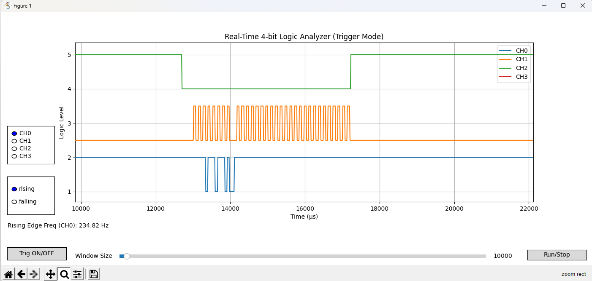

# STM32-Based 4-Channel Logic Analyzer (UART Streaming)

A simple and efficient 4-channel logic analyzer built with an STM32F103-based Nucleo board. It captures digital signals and streams them to a PC over UART using DMA. A Python script with Matplotlib visualizes the signals in real time.


Below is a sample capture from the Python GUI:



---

## ✅ Objective

To capture digital signals from 4 GPIO pins at high sampling rates and transmit them to a PC **without data loss**, using:

- Timer-driven sampling
- Double buffering
- UART with DMA
- Synchronization marker
- Trigger detection for signal stability

---

## 🔧 Hardware Setup

- **MCU**: STM32F103RB (Nucleo-F103RB)
- **System Clock**: 72 MHz
- **Logic Input Pins**: PA0, PA1, PA4, PB0
- **UART Interface**: USART2 via ST-Link Virtual COM Port

---

## 📏 Timing & Sampling Constraints

### UART Configuration

- **Baud Rate**: 921600 bps  
  Each UART frame has:
  - 1 start bit
  - 8 data bits
  - 1 stop bit  
  ⇒ Total = **10 bits per byte**

- **Effective throughput**:  
  `921600 / 10 = 92160 bytes/sec`

If each frame has 1000 samples + 1 marker byte (1001 bytes total),  
Transmission time:  
`1001 × 10 bits = 10010 bits`  
`10010 / 921600 = ~10.86 ms`

### Sampling Rate

At 83.3 kHz (12 µs/sample), 1000 samples take:  
`1000 × 12 µs = 12 ms`  
Since 12 ms > 10.86 ms, this avoids UART overrun and ensures smooth operation.

---

## 🧠 Key Concepts

### ⏱ Timer-Based Sampling

Using **TIM2** to generate periodic interrupts.

Formula:  
`Sampling_Freq = 72 MHz / (Prescaler + 1) / (Period + 1)`

Example:  
- Prescaler = 71  
- Period = 11  
- Sampling Rate = `72000000 / 72 / 12 = 83.3 kHz`

---

### 🔁 Double Buffering

- Two buffers:
  - `current_buffer` – for ongoing sampling
  - `tx_buffer` – for UART transmission  
- Ensures no data is overwritten during DMA transmission.

---

### 🚀 UART with DMA

- DMA handles transmission in the background.
- CPU remains free for continuous sampling.
- `uart_tx_done` flag prevents collisions.

---

## 📦 STM32 Firmware Snippet

```c
// Inside TIM2 Interrupt Handler
if (htim->Instance == TIM2) {
   if (sample_index < SAMPLE_COUNT) {
       if (!uart_tx_done) return;

       uint8_t bit0 = HAL_GPIO_ReadPin(GPIOA, GPIO_PIN_0);
       uint8_t bit1 = HAL_GPIO_ReadPin(GPIOA, GPIO_PIN_1);
       uint8_t bit2 = HAL_GPIO_ReadPin(GPIOA, GPIO_PIN_4);
       uint8_t bit3 = HAL_GPIO_ReadPin(GPIOB, GPIO_PIN_0);

       uint8_t packed = (bit0 << 0) | (bit1 << 1) | (bit2 << 2) | (bit3 << 3);
       current_buffer[sample_index++] = packed;

   } else {
       sampling_done = 1;
       sample_index = 0;

       if (uart_tx_done) {
           tx_packet[0] = marker;
           memcpy(&tx_packet[1], current_buffer, SAMPLE_COUNT);
           current_buffer = (current_buffer == buffer1) ? buffer2 : buffer1;

           uart_tx_done = 0;
           HAL_UART_Transmit_DMA(&huart2, tx_packet, SAMPLE_COUNT + 1);
       }
   }
}
```

```c
// UART DMA completion callback
void HAL_UART_TxCpltCallback(UART_HandleTypeDef *huart) {
    uart_tx_done = 1;
}
```

---

## 🚫 Why Not Sample Faster?

- **UART is the bottleneck**.
- Sampling faster than UART can transmit leads to **buffer overrun**.
- Even with DMA + double buffering, the max rate is limited by UART's data rate.

### To sample faster:
- Increase UART baud rate (if hardware supports it)
- Reduce `SAMPLE_COUNT` (e.g., smaller frames)
- Use **USB CDC** or native **USB bulk transfer**

---

## ✅ Summary

| Component      | Configuration     |
|----------------|-------------------|
| GPIO Inputs    | PA0, PA1, PA4, PB0 |
| UART Baud Rate | 921600            |
| Sample Count   | 1000 per frame    |
| Timer          | TIM2 @ ~83.3 kHz  |
| Marker Byte    | 0xAA              |
| UART Method    | DMA               |
| Buffering      | Double Buffering  |
